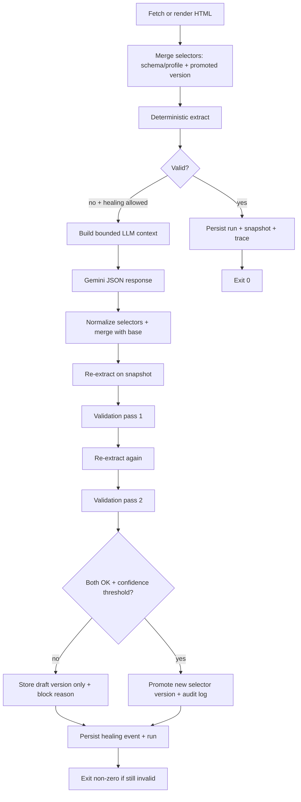

# healscrape architecture

## Goals

1. **Deterministic first**: httpx (and optionally Playwright) fetch + **selectolax** CSS extraction.
2. **Strict validation**: JSON Schema + field rules + explicit reasons; **no silent partial success** for required fields.
3. **Conservative healing**: Gemini proposes selectors + values; repairs are validated twice on the **same snapshot**; **promotion** only if confidence meets `HEALSCRAPE_MIN_PROMOTION_CONFIDENCE`.
4. **Operator auditability**: runs, snapshots, traces, healing events, raw LLM payloads (where configured), selector versions.

## Major components

| Layer | Responsibility |
|-------|------------------|
| `healscrape.cli` | Typer CLI, global logging, session lifecycle, output sinks |
| `healscrape.providers.fetch` | httpx client, retries (Tenacity), rate limit, concurrency semaphore |
| `healscrape.providers.browser` | Optional Playwright render |
| `healscrape.providers.llm` | `LlmProvider` protocol; `GeminiProvider`; `MockLlmProvider` (tests) |
| `healscrape.spec.loaders` | JSON Schema + YAML profile → `ExtractSpec` |
| `healscrape.engine.extract` | CSS extraction against HTML |
| `healscrape.engine.validate` | JSON Schema + field checks + confidence |
| `healscrape.engine.service` | End-to-end pipeline, persistence side-effects |
| `healscrape.persistence` | SQLAlchemy models, repositories, Alembic |
| `healscrape.output.sinks` | `json` / `ndjson` / `csv` |

## Extraction & healing flow

## Persistence model (SQLite by default)

- **`sites`**: slug namespace for selector versions and runs.
- **`selector_versions`**: versioned JSON selector map; `draft` vs `promoted`.
- **`scrape_runs`**: command, URL, outcome, exit code, validation JSON, optional result JSON, trace path.
- **`page_snapshots`**: on-disk HTML under `HEALSCRAPE_DATA_DIR/snapshots/<run_uuid>/page.html` plus hash + size.
- **`healing_events`**: failure reason, broken selectors, prompt excerpt, raw LLM output, candidate selectors, both validation flags, promotion metadata.
- **`stored_profiles`**: YAML text registered via `--profile` invocations (`scrape profiles list` reads names).
- **`audit_log`**: promotion and other semantic actions.

## Migrations vs `create_all`

- **Source checkout**: `alembic/` + `alembic.ini` live beside `src/`; `upgrade_database()` runs `alembic upgrade head` when those files exist (see `healscrape/persistence/bootstrap.py`).
- **Wheel without Alembic files**: bootstrap falls back to `Base.metadata.create_all` for developer convenience; production deployments should run from a tree that includes migrations or manage schema externally.

## LLM boundary

- Context includes **truncated visible text**, **current selector map**, **deterministic extraction output**, and **small DOM snippets** per existing selector (when present).
- No full raw HTML is sent by default beyond snippet harvesting; tune `HEALSCRAPE_LLM_MAX_INPUT_CHARS`.

## Non-goals

- CAPTCHA solving, credential stuffing, fingerprint evasion, or other abuse-oriented bypass tooling.

## Extension points

- **New LLM backend**: implement `complete_json(system, user) -> str` matching `LlmProvider`.
- **Alternative fetchers**: same interface as `HttpFetcher.get` / `FakeFetcher` in tests (inject via future DI if you outgrow the current layout).
- **Output sinks**: extend `healscrape.output.sinks.format_output`.
